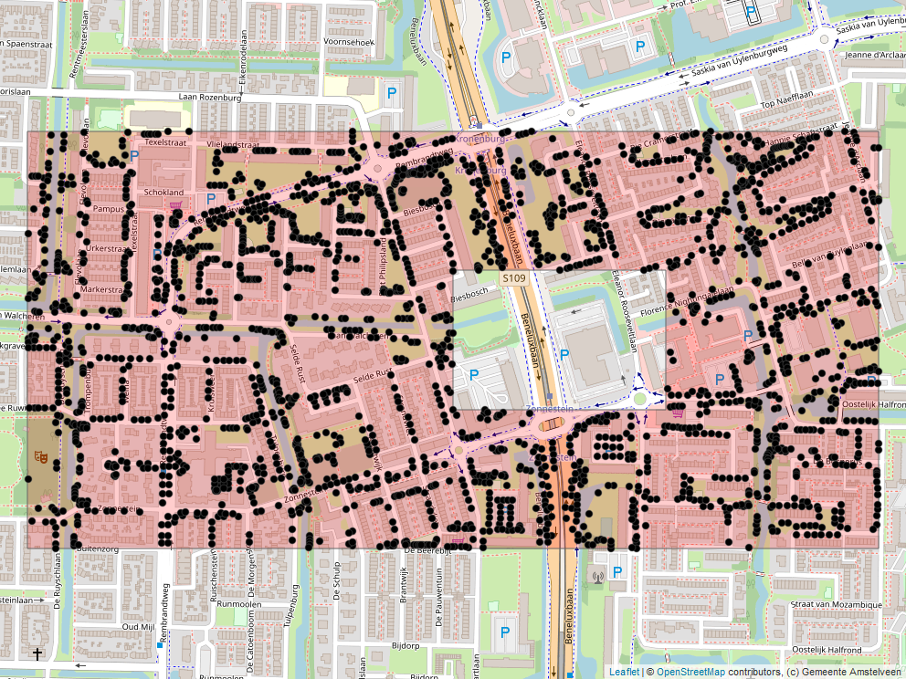

<!-- README.md is generated from README.Rmd. Please edit that file -->

```{r, include = FALSE}
knitr::opts_chunk$set(
  collapse = TRUE,
  comment = "#>",
  fig.path = "man/figures/README-",
  out.width = "100%"
)
```

## HOQCwfs

<!-- badges: start -->
<!-- badges: end -->

### R Web Feature Service (WFS) read-only interface
This package contains functions to retrieve spatial information from a Web Feature Service (WFS) resource. A WFS server supports a number of geospatial output formats, but the package `HOQCwfs` returns by default the [simple features](https://en.wikipedia.org/wiki/Simple_Features) format.   
The conversion of the `json` server data to the `sf` format is done by the package [sf](https://cran.r-project.org/package=sf). For more information about the `sf` package see [Simple Features for R](https://r-spatial.github.io/sf/).

The `sf` format has the advantage that non-spatial attributes of the features are contained in a standard `data.frame`. This `data.frame` is extended with a column that contains the geometry of the features. Non-spatial manipulation of the `data.frame` can be done in the normal way by using the [dplyr](https://cran.r-project.org/package=dplyr) package. For spatial manipulation the functions of the  `sf` package can be used. However spatial filtering can also be done by the WFS server when the user specifies a spatial query.

The `HOQCwfs` package contains functions :  

- to create queries to run on the WFS server for use in `WFS_getfeature`
- to find out the capabilities a WFS server (`WFS_getcapabities`)   
- to find out which featuretypes a WFS server contains (`WFS_featuretypes`) 
- to find out which fields a featuretype contains (`WFS_describefeaturetype`) 

The examples in this package center around featuretype `topp:gidw_groenbomen` from WFS server  `https://geoweb.amstelveen.nl/geoserver/topp/wfs`. In that case the features are trees with the Point geometry.

### Installation

You can install this version from [GitHub](https://github.com/) with: 

``` r
# install.packages("devtools")
devtools::install_github("HanOostdijk/HOQCwfs",build_vignettes=TRUE) 
```

## How to use HOQCwfs

In this `README` one example is given. See the vignette for more examples.

In this example the trees are retrieved in a rectangular area that has a hole in its interior. 
After defining the area and the filter (query) the actual `WFS_getfeature` request is done.
The last part of the example displays the area and the selected trees with a `Open Street Map` background with the aid of the packages [tmap](https://cran.r-project.org/package=tmap) and [leaflet](https://cran.r-project.org/package=leaflet).

```{r}
library(HOQCwfs)
# define outer en inner rectangle in WGS 84 coordinates
out_wgs84 <- c( 4.86,  52.31,  4.86, 52.316, 4.88,  52.316, 
                 4.88,  52.31,  4.86, 52.31)
in_wgs84  <- c( 4.87,  52.312, 4.87, 52.314, 4.875, 52.314, 
                 4.875, 52.312, 4.87, 52.312)
# convert coordinates form WGS84 (EPSG:4326) to the Dutch CRS EPSG:28992
out_28992 <- convert_points(out_wgs84,"EPSG:4326","EPSG:28992")
in_28992  <- convert_points(in_wgs84,"EPSG:4326","EPSG:28992")

# define the filter that selects all points that intersect the rectangle with hole
# use EPSG:28992 because that is the default CRS for this WFS server (data set)
xml_query <- build_filter(version='1.1.0',
     spat_xml('geometrie',
              spat_feature('Polygon','EPSG:28992',list(out_28992,in_28992)),
              spat_fun='Intersects')
  )
# set WFS server (not necessary here because this is the default)
WFS_set_url("https://geoweb.amstelveen.nl/geoserver/topp/wfs")
# set typename (dataset) and attributes that will be retrieved
typename  <- 'topp:gidw_groenbomen'
fields    <- 'boom_omschrijf,objec_omschrijf'
# retrieve the data from the WFS server using the filter
wfs1      <-  WFS_getfeature(typename
             ,filter=xml_query
             ,propertyname=fields)
# show number of trees and attributes
dim(wfs1)
# show only the first two features
head(wfs1,2)

# load libraries needed for visualization
library(tmap)
library(leaflet)
# set tmap options
opts         <- tmap_options(basemaps = c(Canvas = "OpenStreetMap"))
current.mode <- tmap_mode("view")
# define the rectangle with hole as a simple features object 
my_poly      <- sf::st_sfc(sf::st_polygon(list(out_28992,in_28992)),
                           crs='EPSG:28992')
# id and title useful in interactive mode
id    <- "boom_omschrijf"
title <- "boom"
# create map with rectangle and dots
`%>%` <-  magrittr::`%>%`
map1  <-
  tm_shape(my_poly) + # rectangle
    tm_polygons(alpha = 0.2, col = "red") +
  tm_shape(wfs1) +    # trees
    tm_dots(size = 0.05,
            id = id,
            title = title)
# add Open Street Map background
map2  <- tmap_leaflet(map1) %>% 
  addTiles(attribution = "(c) Gemeente Amstelveen")
# save map in png format to include in README
mapview::mapshot(map2, file = "./images/trees_in-rectangle_with_hole.png")

```



